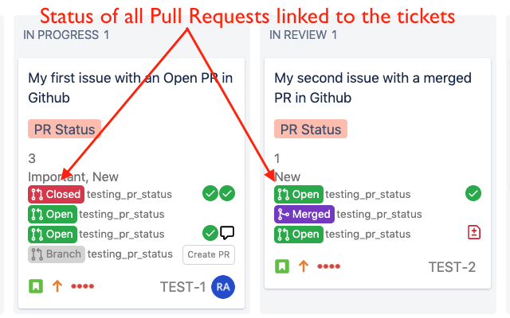

# PR Status

A chrome extension to insert the GitHub PR Review status in the cards on a Jira boards.

* Clean and simple design
* Only shows relevant and important information 
  * PR Status (Open or Merged)
  * Repo name
  * PR Reviews statuses from each user
* Works with new JIRA boards (next-gen).

## Motivation

It may help during a stand up session to quickly identify which tickets have their pull requests been reviewed and approved. 

## Setup

To configure the extension please provide your Github token in the Options page:

**Gihub Token:** Generate a github personal access token from https://github.com/settings/tokens. This token should at least have 'repo' scopes.

Once entered, press the Check button to validate the token. It should show the result of validation below the token input area. the token has correct scopes. 

## JIRA Column  

This extension automatically picks up all the tickets found in the middle columns of any board to be populated with the PR Review statuses (i.e. all columns other than the first and the last column). Therefore no manual configuration entry is required. This allows it to work on any board. 

In future it may allow more fine tuning / customization to restrict columns that should be updated.

## Features

- Shows the status of all PRs linked with the ticket (Requires Github integration to be available)
- Shows the repo name next to the PR status.
- Also shows a quick overview of all the reviews of the related PR (Commented / Approved / Change Requested). Only shows the latest status from each unique users. Always shows the Approval and Change requested from a user.
- The PR status icons (Open or Merged) are clickable to jump straight to the PR in Github. 
- The status is automatically updated regularly but can also be manually refreshed at anytime by clicking on the extension icon or by reloading the page.
